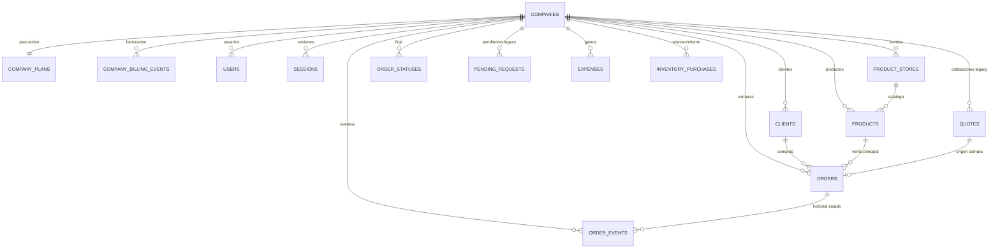

# Shopper Calculator - Base de datos y conexiones

## Diagrama ER (alto nivel)



## Tablas clave para operación móvil/web

- `companies`: empresa (tenant).
- `users`: usuarios por empresa (owner/admin/operator/viewer).
- `clients`: clientes comerciales.
- `product_stores`: tiendas/fuentes de compra.
- `products`: catálogo.
- `orders`: compra/venta principal con `advance_paid_cop`, `balance_due_cop`, `status_key`.
- `order_events`: bitácora de cambios y pagos.
- `company_plans`: plan/membresía de cada empresa.
- `company_billing_events`: eventos de cobro de la suscripción.

## Conexiones

### Local (SQLite)

- Ruta DB local (default): `data/fershop.sqlite3`
- Variable opcional: `FERSHOP_DB_PATH`

Consulta rápida:

```powershell
sqlite3 data/fershop.sqlite3 "SELECT id, name, brand_name, is_active FROM companies;"
```

### Producción (Render + PostgreSQL)

- Render inyecta `DATABASE_URL` al web service.
- También soporta `FERSHOP_DATABASE_URL`.
- Zona horaria recomendada:
  - `FERSHOP_TIMEZONE=America/Bogota`
  - `TZ=America/Bogota`

Consulta rápida en psql (usar tu `DATABASE_URL` de Render):

```powershell
psql "$env:DATABASE_URL" -c "SELECT id, slug, name, is_active FROM companies ORDER BY id DESC LIMIT 20;"
```

## Validaciones útiles

```sql
-- Empresas activas y estado de plan
SELECT c.id, c.slug, c.name, c.is_active, cp.plan_name, cp.billing_status
FROM companies c
LEFT JOIN company_plans cp ON cp.company_id = c.id
ORDER BY c.id DESC;

-- Compras con saldo pendiente
SELECT id, client_name, status_key, sale_price_cop, advance_paid_cop, balance_due_cop
FROM orders
WHERE balance_due_cop > 0
ORDER BY id DESC
LIMIT 100;

-- Eventos de facturación recientes
SELECT company_billing_events.company_id, companies.name AS company_name, event_type, amount_usd, status, created_at
FROM company_billing_events
JOIN companies ON companies.id = company_billing_events.company_id
ORDER BY company_billing_events.id DESC
LIMIT 100;
```
